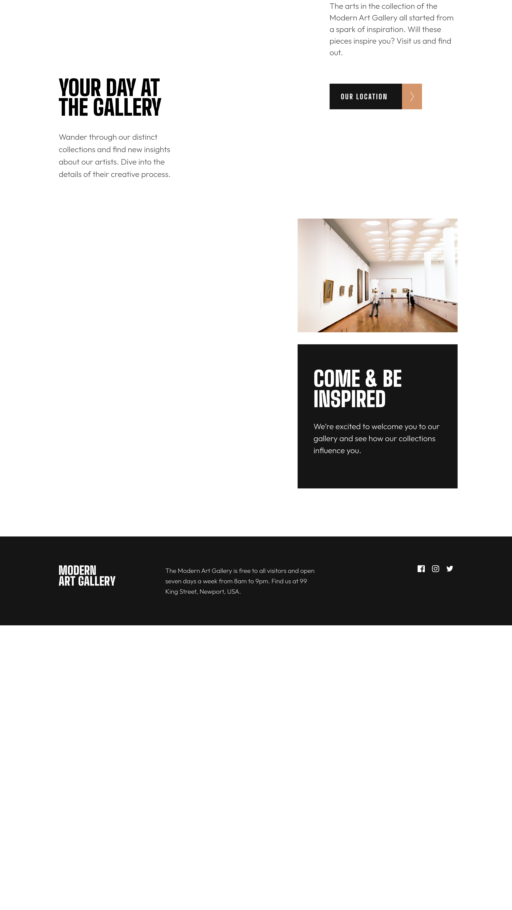
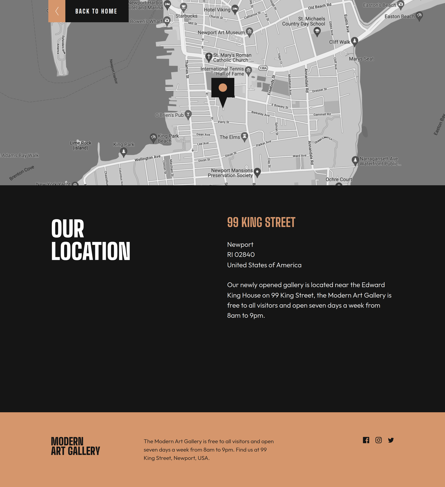
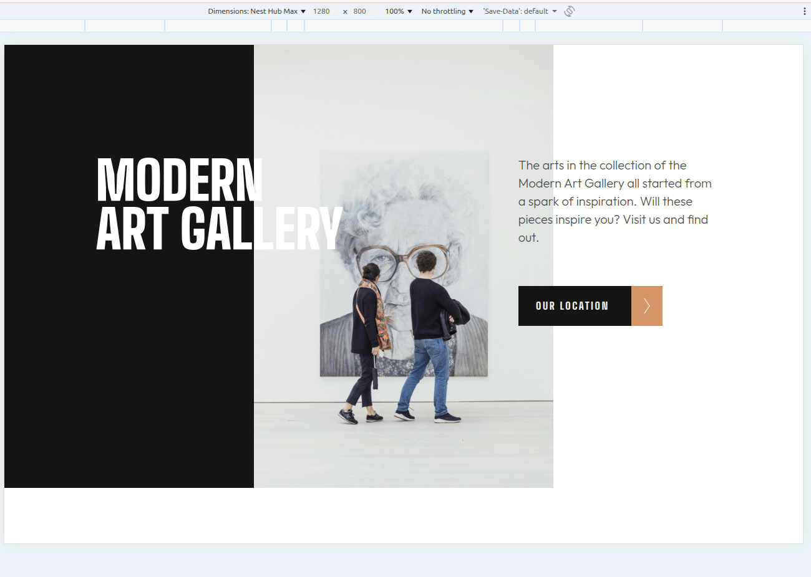

# Modern Art Gallery

🔗 [Live Demo](https://irenemendoza.github.io/modern-art-gallery/)

A responsive two-page website for a modern art gallery, built following a Figma design with a mobile-first approach and focus on fluid, scalable layouts.

## 📸 Preview




### ✨ Interactive Demo



## ✨ Features

- **Mobile-first responsive design** with three breakpoints:
  - Mobile: < 768px (optimized for iPhone SE - 375x667)
  - Tablet: 768px - 1199px (optimized for iPad Air - 820x1180)
  - Desktop: ≥ 1200px (optimized for Nest Hub Max - 1280x800)
- **Semantic HTML** for better accessibility and SEO
- **Interactive hover effects** on buttons and links
- **Optimized SVG icons**
- **Relative units** (vw, rem) for scalable, fluid layouts
- Two-page structure (home and location)
- Pixel-perfect implementation from Figma mockup

**Note:** The design is specifically optimized for the dimensions listed above and may require adjustments for other viewport sizes.

## 🛠️ Tech Stack

- **HTML5** - Semantic structure
- **SCSS/Sass** - CSS preprocessor with organized architecture
- **Vite** - Build tool and dev server
- **SVG** - Scalable icons

## 🚀 Getting Started

### Prerequisites

- Node.js (v14 or higher)
- npm or yarn

### Installation
```bash
# Clone the repository
git clone https://github.com/irenemendoza/modern-art-gallery.git

# Navigate to directory
cd modern-art-gallery

# Install dependencies
npm install

# Start development server
npm run dev
```

The project will be available at `http://localhost:5173`

## 📦 Available Scripts
```bash
npm run dev      # Development server
npm run build    # Production build
npm run preview  # Preview build
npm run deploy   # Deploy to GitHub Pages
```

## 🚢 Deployment

The project automatically deploys to GitHub Pages:
```bash
npm run deploy
```

This generates the build and publishes it to the `gh-pages` branch.

## 📋 Project Structure
```
modern-art-gallery/
├── src/
│   ├── styles/
│   │   ├── _variables.scss
│   │   ├── _mixins.scss
│   │   └── main.scss
│   ├── assets/
│   │   └── icons/
│   ├── index.html
│   └── location.html
├── docs/              # Screenshots
├── package.json
└── vite.config.js
```

## 🎯 Development Focus

- Pixel-perfect Figma design implementation
- **Mobile-first approach** for optimal performance
- **Relative units over fixed pixels** for better scalability
- CSS hover states and smooth transitions
- Reusable SCSS components
- Asset optimization (SVG)

## 📱 Pages

- **Home**: Gallery presentation with featured artworks
- **Location**: Map and contact information

## 👩‍💻 Author

**Irene Mendoza**
- GitHub: [@irenemendoza](https://github.com/irenemendoza)
- Portfolio: [irenemendoza.github.io](https://irenemendoza.github.io/portfolio-project/)

---

⭐ If you liked this project, give it a star!